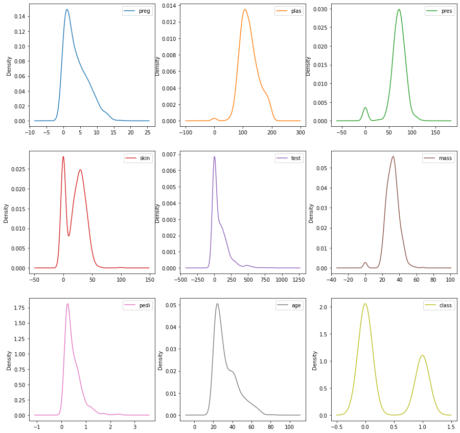

**This document has been created based on article (in the references [1])**

# Business problem
"*We will create a predictive model from the precise definition of the problem. We want to create a model that can predict whether or not a person can develop a disease — Diabetes.*

*For this, we will use historical patient data available in the Dataset: **Pima Indians Diabetes Data Set** that describes the medical records among Pima Indians patients. Each record is marked whether or not the patient developed Diabetes.*"

**Link to dataset:** https://www.kaggle.com/uciml/pima-indians-diabetes-database

## Information about dataset
The set contains multivariate data, can be applied to time series, has categorical datam integer data, and **20 attributes**.

**Main Attributes**
* Number of times pregnant
* Plasma glucose concentration a 2 hours in an oral glucose
* Diastolic blood pressure (mm Hg)
* Triceps skin fold thickness (mm)
* 2-Hour serum insulin (mu U/ml
* Body mass index (weight in kg/(height in m)²)
* Diabetes pedigree function
* Age (years)
* Class variable (0 or 1)

# Extract and load data


```python
# Loading csv file (Pandas)
from pandas import read_csv
file = 'diabetes.csv'
columns = ['preg', 'plas', 'pres', 'skin', 'test', 'mass', 'pedi', 'age', 'class']
['preg', 'plas', 'pres', 'skin', 'test', 'mass', 'pedi', 'age', 'class']
```


    ['preg', 'plas', 'pres', 'skin', 'test', 'mass', 'pedi', 'age', 'class']


```python
# Read csv file with specified columns via variable 'columns', skip 1-st row because it cointains org headers
data = read_csv(file, names=columns, skiprows=1)
```


```python
# This is only information - in this scope I'm using way related with pandas and method read_csv
# Loading csv file using NumPy - Second Way
# NumPy Library Provides Data Structure for Data Storage
import numpy as np
file_n = 'diabetes.csv' 

# Open file with proper permissions
file_data_n = open(file_n, 'rb')

# Numpy loadtxt(), check delimiter function
data_n = np.genfromtxt(file_data_n, delimiter = ",", skip_header=True)

# Check number of instances and attributes
print(data_n.shape)
```

    (768, 9)
    


```python
# First 10 rows
data.head(10)
```


<div>
<style scoped>
    .dataframe tbody tr th:only-of-type {
        vertical-align: middle;
    }

    .dataframe tbody tr th {
        vertical-align: top;
    }

    .dataframe thead th {
        text-align: right;
    }
</style>
<table border="1" class="dataframe">
  <thead>
    <tr style="text-align: right;">
      <th></th>
      <th>preg</th>
      <th>plas</th>
      <th>pres</th>
      <th>skin</th>
      <th>test</th>
      <th>mass</th>
      <th>pedi</th>
      <th>age</th>
      <th>class</th>
    </tr>
  </thead>
  <tbody>
    <tr>
      <th>0</th>
      <td>6</td>
      <td>148</td>
      <td>72</td>
      <td>35</td>
      <td>0</td>
      <td>33.6</td>
      <td>0.627</td>
      <td>50</td>
      <td>1</td>
    </tr>
    <tr>
      <th>1</th>
      <td>1</td>
      <td>85</td>
      <td>66</td>
      <td>29</td>
      <td>0</td>
      <td>26.6</td>
      <td>0.351</td>
      <td>31</td>
      <td>0</td>
    </tr>
    <tr>
      <th>2</th>
      <td>8</td>
      <td>183</td>
      <td>64</td>
      <td>0</td>
      <td>0</td>
      <td>23.3</td>
      <td>0.672</td>
      <td>32</td>
      <td>1</td>
    </tr>
    <tr>
      <th>3</th>
      <td>1</td>
      <td>89</td>
      <td>66</td>
      <td>23</td>
      <td>94</td>
      <td>28.1</td>
      <td>0.167</td>
      <td>21</td>
      <td>0</td>
    </tr>
    <tr>
      <th>4</th>
      <td>0</td>
      <td>137</td>
      <td>40</td>
      <td>35</td>
      <td>168</td>
      <td>43.1</td>
      <td>2.288</td>
      <td>33</td>
      <td>1</td>
    </tr>
    <tr>
      <th>5</th>
      <td>5</td>
      <td>116</td>
      <td>74</td>
      <td>0</td>
      <td>0</td>
      <td>25.6</td>
      <td>0.201</td>
      <td>30</td>
      <td>0</td>
    </tr>
    <tr>
      <th>6</th>
      <td>3</td>
      <td>78</td>
      <td>50</td>
      <td>32</td>
      <td>88</td>
      <td>31.0</td>
      <td>0.248</td>
      <td>26</td>
      <td>1</td>
    </tr>
    <tr>
      <th>7</th>
      <td>10</td>
      <td>115</td>
      <td>0</td>
      <td>0</td>
      <td>0</td>
      <td>35.3</td>
      <td>0.134</td>
      <td>29</td>
      <td>0</td>
    </tr>
    <tr>
      <th>8</th>
      <td>2</td>
      <td>197</td>
      <td>70</td>
      <td>45</td>
      <td>543</td>
      <td>30.5</td>
      <td>0.158</td>
      <td>53</td>
      <td>1</td>
    </tr>
    <tr>
      <th>9</th>
      <td>8</td>
      <td>125</td>
      <td>96</td>
      <td>0</td>
      <td>0</td>
      <td>0.0</td>
      <td>0.232</td>
      <td>54</td>
      <td>1</td>
    </tr>
  </tbody>
</table>
</div>


```python
# Check the dimenrsions of the Dataset
data.shape
```


    (768, 9)


### What is shape in pandas?
The shape attribute stores the number of rows and columns as tupe => **(number of rows, number of columns)**
Based on current dataset we have **768 rows** and **9 columns**.

## Check Type of the Data


```python
# Data type of each attribute
data.dtypes
```


    preg       int64
    plas       int64
    pres       int64
    skin       int64
    test       int64
    mass     float64
    pedi     float64
    age        int64
    class      int64
    dtype: object


```python
## Let's see more details about this dataset
data.info()
```

    <class 'pandas.core.frame.DataFrame'>
    RangeIndex: 768 entries, 0 to 767
    Data columns (total 9 columns):
     #   Column  Non-Null Count  Dtype  
    ---  ------  --------------  -----  
     0   preg    768 non-null    int64  
     1   plas    768 non-null    int64  
     2   pres    768 non-null    int64  
     3   skin    768 non-null    int64  
     4   test    768 non-null    int64  
     5   mass    768 non-null    float64
     6   pedi    768 non-null    float64
     7   age     768 non-null    int64  
     8   class   768 non-null    int64  
    dtypes: float64(2), int64(7)
    memory usage: 54.1 KB
    

### What is info in pandas?
This function is used to get a brief summary of the dataframe.
This method prints information about a **DataFrame** including the **index**, **dtype**, **column dtypes**, **non-null values**, and **memory usage**.


```python
print('Size:', data.size)
print('Ndim:', data.ndim)
print('Index:', data.index)
print('Columns:', data.columns)
print('Duplicated rows:\n', data.duplicated)
```

    Size: 6912
    Ndim: 2
    Index: RangeIndex(start=0, stop=768, step=1)
    Columns: Index(['preg', 'plas', 'pres', 'skin', 'test', 'mass', 'pedi', 'age', 'class'], dtype='object')
    Duplicated rows:
     <bound method DataFrame.duplicated of      preg  plas  pres  skin  test  mass   pedi  age  class
    0       6   148    72    35     0  33.6  0.627   50      1
    1       1    85    66    29     0  26.6  0.351   31      0
    2       8   183    64     0     0  23.3  0.672   32      1
    3       1    89    66    23    94  28.1  0.167   21      0
    4       0   137    40    35   168  43.1  2.288   33      1
    ..    ...   ...   ...   ...   ...   ...    ...  ...    ...
    763    10   101    76    48   180  32.9  0.171   63      0
    764     2   122    70    27     0  36.8  0.340   27      0
    765     5   121    72    23   112  26.2  0.245   30      0
    766     1   126    60     0     0  30.1  0.349   47      1
    767     1    93    70    31     0  30.4  0.315   23      0
    
    [768 rows x 9 columns]>
    


```python
data.duplicated().sum()
```


    0


```python
data['class'].value_counts()
```


    0    500
    1    268
    Name: class, dtype: int64


```python
data.nunique()
```


    preg      17
    plas     136
    pres      47
    skin      51
    test     186
    mass     248
    pedi     517
    age       52
    class      2
    dtype: int64


```python
data.isnull().sum()
```


    preg     0
    plas     0
    pres     0
    skin     0
    test     0
    mass     0
    pedi     0
    age      0
    class    0
    dtype: int64


### Other methods from pandas
* **Size** - Return an int representing the number of elements in this object.
* **Ndim** - Returns dimension of dataframe/series. 
    * 1 for one dimension (series), 
    * 2 for two dimensions (dataframe)
* **Index** - This function searches for a given element from the start of the list and returns the lowest index where the element appears
* **Duplicated** - Returns a boolean Series denoting duplicate rows.
* **Value_counts** - This function is used to get a Series containing counts of unique values
* **Nunique** - Return number of unique elements in the object
* Combination **isnull** and **sum** - Return number of missing values in each column

## Statistical Sumary


```python
data.describe()
```


<div>
<style scoped>
    .dataframe tbody tr th:only-of-type {
        vertical-align: middle;
    }

    .dataframe tbody tr th {
        vertical-align: top;
    }

    .dataframe thead th {
        text-align: right;
    }
</style>
<table border="1" class="dataframe">
  <thead>
    <tr style="text-align: right;">
      <th></th>
      <th>preg</th>
      <th>plas</th>
      <th>pres</th>
      <th>skin</th>
      <th>test</th>
      <th>mass</th>
      <th>pedi</th>
      <th>age</th>
      <th>class</th>
    </tr>
  </thead>
  <tbody>
    <tr>
      <th>count</th>
      <td>768.000000</td>
      <td>768.000000</td>
      <td>768.000000</td>
      <td>768.000000</td>
      <td>768.000000</td>
      <td>768.000000</td>
      <td>768.000000</td>
      <td>768.000000</td>
      <td>768.000000</td>
    </tr>
    <tr>
      <th>mean</th>
      <td>3.845052</td>
      <td>120.894531</td>
      <td>69.105469</td>
      <td>20.536458</td>
      <td>79.799479</td>
      <td>31.992578</td>
      <td>0.471876</td>
      <td>33.240885</td>
      <td>0.348958</td>
    </tr>
    <tr>
      <th>std</th>
      <td>3.369578</td>
      <td>31.972618</td>
      <td>19.355807</td>
      <td>15.952218</td>
      <td>115.244002</td>
      <td>7.884160</td>
      <td>0.331329</td>
      <td>11.760232</td>
      <td>0.476951</td>
    </tr>
    <tr>
      <th>min</th>
      <td>0.000000</td>
      <td>0.000000</td>
      <td>0.000000</td>
      <td>0.000000</td>
      <td>0.000000</td>
      <td>0.000000</td>
      <td>0.078000</td>
      <td>21.000000</td>
      <td>0.000000</td>
    </tr>
    <tr>
      <th>25%</th>
      <td>1.000000</td>
      <td>99.000000</td>
      <td>62.000000</td>
      <td>0.000000</td>
      <td>0.000000</td>
      <td>27.300000</td>
      <td>0.243750</td>
      <td>24.000000</td>
      <td>0.000000</td>
    </tr>
    <tr>
      <th>50%</th>
      <td>3.000000</td>
      <td>117.000000</td>
      <td>72.000000</td>
      <td>23.000000</td>
      <td>30.500000</td>
      <td>32.000000</td>
      <td>0.372500</td>
      <td>29.000000</td>
      <td>0.000000</td>
    </tr>
    <tr>
      <th>75%</th>
      <td>6.000000</td>
      <td>140.250000</td>
      <td>80.000000</td>
      <td>32.000000</td>
      <td>127.250000</td>
      <td>36.600000</td>
      <td>0.626250</td>
      <td>41.000000</td>
      <td>1.000000</td>
    </tr>
    <tr>
      <th>max</th>
      <td>17.000000</td>
      <td>199.000000</td>
      <td>122.000000</td>
      <td>99.000000</td>
      <td>846.000000</td>
      <td>67.100000</td>
      <td>2.420000</td>
      <td>81.000000</td>
      <td>1.000000</td>
    </tr>
  </tbody>
</table>
</div>


```python
# Let's round to 2-nd decimal place
data.describe().round(2)
```


<div>
<style scoped>
    .dataframe tbody tr th:only-of-type {
        vertical-align: middle;
    }

    .dataframe tbody tr th {
        vertical-align: top;
    }

    .dataframe thead th {
        text-align: right;
    }
</style>
<table border="1" class="dataframe">
  <thead>
    <tr style="text-align: right;">
      <th></th>
      <th>preg</th>
      <th>plas</th>
      <th>pres</th>
      <th>skin</th>
      <th>test</th>
      <th>mass</th>
      <th>pedi</th>
      <th>age</th>
      <th>class</th>
    </tr>
  </thead>
  <tbody>
    <tr>
      <th>count</th>
      <td>768.00</td>
      <td>768.00</td>
      <td>768.00</td>
      <td>768.00</td>
      <td>768.00</td>
      <td>768.00</td>
      <td>768.00</td>
      <td>768.00</td>
      <td>768.00</td>
    </tr>
    <tr>
      <th>mean</th>
      <td>3.85</td>
      <td>120.89</td>
      <td>69.11</td>
      <td>20.54</td>
      <td>79.80</td>
      <td>31.99</td>
      <td>0.47</td>
      <td>33.24</td>
      <td>0.35</td>
    </tr>
    <tr>
      <th>std</th>
      <td>3.37</td>
      <td>31.97</td>
      <td>19.36</td>
      <td>15.95</td>
      <td>115.24</td>
      <td>7.88</td>
      <td>0.33</td>
      <td>11.76</td>
      <td>0.48</td>
    </tr>
    <tr>
      <th>min</th>
      <td>0.00</td>
      <td>0.00</td>
      <td>0.00</td>
      <td>0.00</td>
      <td>0.00</td>
      <td>0.00</td>
      <td>0.08</td>
      <td>21.00</td>
      <td>0.00</td>
    </tr>
    <tr>
      <th>25%</th>
      <td>1.00</td>
      <td>99.00</td>
      <td>62.00</td>
      <td>0.00</td>
      <td>0.00</td>
      <td>27.30</td>
      <td>0.24</td>
      <td>24.00</td>
      <td>0.00</td>
    </tr>
    <tr>
      <th>50%</th>
      <td>3.00</td>
      <td>117.00</td>
      <td>72.00</td>
      <td>23.00</td>
      <td>30.50</td>
      <td>32.00</td>
      <td>0.37</td>
      <td>29.00</td>
      <td>0.00</td>
    </tr>
    <tr>
      <th>75%</th>
      <td>6.00</td>
      <td>140.25</td>
      <td>80.00</td>
      <td>32.00</td>
      <td>127.25</td>
      <td>36.60</td>
      <td>0.63</td>
      <td>41.00</td>
      <td>1.00</td>
    </tr>
    <tr>
      <th>max</th>
      <td>17.00</td>
      <td>199.00</td>
      <td>122.00</td>
      <td>99.00</td>
      <td>846.00</td>
      <td>67.10</td>
      <td>2.42</td>
      <td>81.00</td>
      <td>1.00</td>
    </tr>
  </tbody>
</table>
</div>


*"In **classification problems**, it may be necessary to **balance the classes**. 
**Unbalanced classes** (more significant volumes of one of the class types) are common and need to be addressed during the pre-processing phase.*

*We can see below that there is an evident disproportion between **classes 0** *(non-occurrence of diabetes)* and **1** *(occurrence of diabetes)*.*

*We apply the class variable to the Pandas groupby function and measure its size:"*


```python
# Class distribution
data.groupby('class').size()
```


    class
    0    500
    1    268
    dtype: int64


Based on code above, we have **500 records** with **class 0** and **268** with **class 1**, so **more records** where people **have not developed** Diabetes than **people who have developed**. 

*"When the algorithm goes through these numbers, it will end up learning more about a person who **does not have Diabetes** than a person who **has Diabetes** — we need to have the same proportion for the two classes of the set."*

## Corelation
To understand the relationship between data is through correlation. 
**Correlation coefficients** are used to measure how strong a relationship is between two variables.

The most common method for calculating correlation is the **Pearson method**, which assumes a normal distribution of data.
* A correlation of **-1** shows a **negative correlation**
* A correlation of **+1** shows a **positive correlation**
* A correlation of **0** indicates that there is **no relationship** between the variables.

Some algorithms such as **a linear regression** and **logistic regression** can present performance problems with **highly correlated (collinear)** attributes.


```python
# Apply Pearson's correlation between all variables in the dataset 
data.corr(method='pearson')
```


<div>
<style scoped>
    .dataframe tbody tr th:only-of-type {
        vertical-align: middle;
    }

    .dataframe tbody tr th {
        vertical-align: top;
    }

    .dataframe thead th {
        text-align: right;
    }
</style>
<table border="1" class="dataframe">
  <thead>
    <tr style="text-align: right;">
      <th></th>
      <th>preg</th>
      <th>plas</th>
      <th>pres</th>
      <th>skin</th>
      <th>test</th>
      <th>mass</th>
      <th>pedi</th>
      <th>age</th>
      <th>class</th>
    </tr>
  </thead>
  <tbody>
    <tr>
      <th>preg</th>
      <td>1.000000</td>
      <td>0.129459</td>
      <td>0.141282</td>
      <td>-0.081672</td>
      <td>-0.073535</td>
      <td>0.017683</td>
      <td>-0.033523</td>
      <td>0.544341</td>
      <td>0.221898</td>
    </tr>
    <tr>
      <th>plas</th>
      <td>0.129459</td>
      <td>1.000000</td>
      <td>0.152590</td>
      <td>0.057328</td>
      <td>0.331357</td>
      <td>0.221071</td>
      <td>0.137337</td>
      <td>0.263514</td>
      <td>0.466581</td>
    </tr>
    <tr>
      <th>pres</th>
      <td>0.141282</td>
      <td>0.152590</td>
      <td>1.000000</td>
      <td>0.207371</td>
      <td>0.088933</td>
      <td>0.281805</td>
      <td>0.041265</td>
      <td>0.239528</td>
      <td>0.065068</td>
    </tr>
    <tr>
      <th>skin</th>
      <td>-0.081672</td>
      <td>0.057328</td>
      <td>0.207371</td>
      <td>1.000000</td>
      <td>0.436783</td>
      <td>0.392573</td>
      <td>0.183928</td>
      <td>-0.113970</td>
      <td>0.074752</td>
    </tr>
    <tr>
      <th>test</th>
      <td>-0.073535</td>
      <td>0.331357</td>
      <td>0.088933</td>
      <td>0.436783</td>
      <td>1.000000</td>
      <td>0.197859</td>
      <td>0.185071</td>
      <td>-0.042163</td>
      <td>0.130548</td>
    </tr>
    <tr>
      <th>mass</th>
      <td>0.017683</td>
      <td>0.221071</td>
      <td>0.281805</td>
      <td>0.392573</td>
      <td>0.197859</td>
      <td>1.000000</td>
      <td>0.140647</td>
      <td>0.036242</td>
      <td>0.292695</td>
    </tr>
    <tr>
      <th>pedi</th>
      <td>-0.033523</td>
      <td>0.137337</td>
      <td>0.041265</td>
      <td>0.183928</td>
      <td>0.185071</td>
      <td>0.140647</td>
      <td>1.000000</td>
      <td>0.033561</td>
      <td>0.173844</td>
    </tr>
    <tr>
      <th>age</th>
      <td>0.544341</td>
      <td>0.263514</td>
      <td>0.239528</td>
      <td>-0.113970</td>
      <td>-0.042163</td>
      <td>0.036242</td>
      <td>0.033561</td>
      <td>1.000000</td>
      <td>0.238356</td>
    </tr>
    <tr>
      <th>class</th>
      <td>0.221898</td>
      <td>0.466581</td>
      <td>0.065068</td>
      <td>0.074752</td>
      <td>0.130548</td>
      <td>0.292695</td>
      <td>0.173844</td>
      <td>0.238356</td>
      <td>1.000000</td>
    </tr>
  </tbody>
</table>
</div>


**Below**, we have **a symmetry index** for each of the variables. We can understand how **variables** are **distributed** and decide if we will apply some **normalization technique** to put the variable in standard distribution format


```python
data.skew()
```


    preg     0.901674
    plas     0.173754
    pres    -1.843608
    skin     0.109372
    test     2.272251
    mass    -0.428982
    pedi     1.919911
    age      1.129597
    class    0.635017
    dtype: float64


# Matplotlib Visualization


```python
import matplotlib.pyplot as plt
from matplotlib.pyplot import figure
%matplotlib inline
```

## Histogram
If we want to **view the histogram** more **broadly in another window**, we need to **reset** the **Jupyter Notebook** and **remove** the **%matplotlib inline**.

A histogram is **an approximate representation** of the **distribution of numerical data**.

With the histogram, we can **quickly** assess **the distribution of each attribute**. Histograms group data into bins and provide a count of the number of observations in each bin.


```python
# Univariate Histogram
data.hist(figsize=(10, 10))
plt.show()
```

    F:\Applications\Anaconda\envs\AI-EXERCISES\lib\site-packages\pandas\plotting\_matplotlib\tools.py:400: MatplotlibDeprecationWarning: 
    The is_first_col function was deprecated in Matplotlib 3.4 and will be removed two minor releases later. Use ax.get_subplotspec().is_first_col() instead.
      if ax.is_first_col():
    


    

    


The attributes *age*, *order* (pedi?), and *test* have **an exponential distribution**.
The attributes *mass* and *press* have **a normal distribution**.

**An exponential distribution**


```python
from PIL import Image
import requests
# Wiki images
url = 'https://upload.wikimedia.org/wikipedia/commons/thumb/0/02/Exponential_probability_density.svg/325px-Exponential_probability_density.svg.png'
url_2 = 'https://upload.wikimedia.org/wikipedia/commons/thumb/b/ba/Exponential_cdf.svg/325px-Exponential_cdf.svg.png'

im_exponential_distribution = Image.open(requests.get(url, stream='True').raw)
im_exponential_distribution_2 = Image.open(requests.get(url_2, stream='True').raw)

im_exponential_distribution
```


    

    


```python
im_exponential_distribution_2
```


    

    


**A normal distribution**


```python
url_3 = 'https://upload.wikimedia.org/wikipedia/commons/thumb/7/74/Normal_Distribution_PDF.svg/220px-Normal_Distribution_PDF.svg.png'
im_normal_distribution = Image.open(requests.get(url_3, stream='True').raw)
im_normal_distribution
```


    

    


## Univariate Density plot

**Density Plots** are another way to visualize **the distribution of data for each attribute**. The plot is like a kind of abstract histogram with a smooth curve through the top of a histogram’s bins.


```python
# Density Plot Univariate 'Density'
data.plot(kind = 'density',
          figsize=(15, 15),
          subplots = True,  
          layout = (3,3), 
          sharex = False)
plt.show()
```

    F:\Applications\Anaconda\envs\AI-EXERCISES\lib\site-packages\pandas\plotting\_matplotlib\tools.py:400: MatplotlibDeprecationWarning: 
    The is_first_col function was deprecated in Matplotlib 3.4 and will be removed two minor releases later. Use ax.get_subplotspec().is_first_col() instead.
      if ax.is_first_col():
    


    

    


## Box Plots

With **boxplots**, we can also review **the data distribution for each attribute**. Boxplot helps to **get an idea of the dispersion of the data** and **identifies outliers quickly**: values that deviate a lot from the data’s average. If you leave the outlier in the dataset, it can affect the predictive model.


```python
# Box and Whisker Plots
data.plot(kind = 'box',
          subplots = True,
          figsize=(15, 15),
          layout = (3,3),
          sharex = False, 
          sharey = False)
plt.show()
```

    F:\Applications\Anaconda\envs\AI-EXERCISES\lib\site-packages\pandas\plotting\_matplotlib\tools.py:400: MatplotlibDeprecationWarning: 
    The is_first_col function was deprecated in Matplotlib 3.4 and will be removed two minor releases later. Use ax.get_subplotspec().is_first_col() instead.
      if ax.is_first_col():
    


    

    


We can see that **the dispersion of the data** is quite different among the attributes. The *age*, *skin*, and *test* columns have symmetry very close to **smaller data values**.

## Correlation Matrix

Let’s create **a correlation matrix** with the names of variables for easy visualization. 
The correlations object will receive all correlations in date through **the corr() function**.

Next, we call **the NumPy** library and **plt.figure** to create a figure. We add **a subplot**; then, we apply the **matshow method** to show the **correlations between variables** in **a range** from **-1** to **+1**. After that, we use **the color** with **fig.colorbar**, create ticks with **np.arange** to set **the square size at 9** (we have **nine columns**), and finalize, making adjustments to ticks and labels.


```python
# Correlation matrix with variable names
correlations = data.corr()       

# The correlations variable receives all data correlations
import numpy as np

# Plot figure with size (standard size is too small for me :))
fig = plt.figure(figsize=(8,8))

# Add subplot
ax = fig.add_subplot(111)

# Show correlations in the range of -1 to +1
cax = ax.matshow (correlations, vmin = -1, vmax = 1) 

# Coloring boxplot
fig.colorbar(cax)

# The array defines the size of the 9x9 square to be plotted
ticks = np.arange(0, 9, 1) 

# Take the size of "ticks" and place it on the x axis
ax.set_xticks(ticks) 

# Take the size of "ticks" and place it on the y axis
ax.set_yticks(ticks)

# Apply the columns listed at the beginning as labels
ax.set_xticklabels(columns)

# Applies the columns listed at the beginning as labels
ax.set_yticklabels(columns) 

# Plot
plt.show()
```


    

    


This graph with **matplotlib** shows **a correlation** chart where:
* **intense yellow** indicates a high correlation. 
* **In contrast, the darker color** indicates a low correlation — an easier way to visualize the correlation between the data.

## Scatter Plot
To conclude, we can plot **a scatter plot** that will show **the relationship between two variables** as **points in two dimensions**, one axis being for each variable. Like the correlation matrix above, **the scatterplot matrix is symmetric**.


```python
# Scatter Matrix
from pandas.plotting import scatter_matrix
scatter_matrix(data, figsize=(15,15))
plt.show()
```


    

    


## Seaborn
Seaborn is a package for building statistical charts so that seaborn can widely use it during the exploratory phase of data with much more uncomplicated and leaner parameters.


```python
import seaborn as sns
sns.pairplot(data)
```


    <seaborn.axisgrid.PairGrid at 0x14361b4e400>


    

    


## Seaborn boxplot


```python
sns.boxplot(data = data, orient = "v")
```


    <AxesSubplot:>


    

    


**The test variable** is the one with the **highest number** of **outliers** With a simple visualization, we have already been able to collect vital information.


```python
# Clustermap to see how the dataset is organized
sns.clustermap(data, figsize=(10,10))
```


    <seaborn.matrix.ClusterGrid at 0x1436288e550>


    

    


## Seaborn distplot
Finally, we have the distplot, calling only one variable from the dataset and using the fit parameter of the Stats module of the SciPy library.

If you look right, we have **three charts** in a **single plot**. We have the **histogram** with **an exponential distribution** and some lines that help us put **statistical summaries**.


```python
from scipy import stats

# Display plot for pedi column
sns.distplot(data.pedi, fit = stats.norm);
```

    F:\Applications\Anaconda\envs\AI-EXERCISES\lib\site-packages\seaborn\distributions.py:2557: FutureWarning: `distplot` is a deprecated function and will be removed in a future version. Please adapt your code to use either `displot` (a figure-level function with similar flexibility) or `histplot` (an axes-level function for histograms).
      warnings.warn(msg, FutureWarning)
    


    

    


# Preparing the Data for Machine Learning

After performing **the Exploratory Analysis** to understand the data, we are ready to start the **pre-processing step**.

This step embraces the transformation of the variables, selects the best ones for model creation, reduces the dimensionality for massive data sets, sampling, and other techniques depending on the data, business problem, or algorithm.

Many algorithms expect to receive data in a specific format. It is our job to prepare the data in a structure that is suitable for the algorithm we are using. The challenge is that each algorithm requires a different system, which may require other transformations in the data. But it is possible in some cases to obtain good results without pre-processing work.

Therefore, the important thing is not to decorate the process but rather to understand when it has to be done. As we work on different projects, the data may already arrive pre-processed.

## Normalization — Method 1 (Scale)

**Source:** https://scikit-learn.org/stable/modules/generated/sklearn.preprocessing.MinMaxScaler.html

**Normalization**, **binarization**, and s**tandardization** are techniques exclusively applied to quantitative variables. 

* **Normalization** changes the scale of the data, and we have two techniques in scikit-learn;
* **Standardization** does not alter the distribution of data, it only places the distribution in a Gaussian format. That is, if the data is already in a normal distribution, we can only standardize it. 
* **Binarization**, which puts the data with the value 0 or 1 according to a rule that we specify.

It is one of the first tasks within **the pre-processing**. It is to put data on the same scale. Many Machine Learning algorithms will benefit from this and produce better results. 
This step is also called Normalization and means putting the data on a scale with **a range between 0 and 1**.

**Normalization** is valuable for **optimization**, being used in **the core of the Machine Learning algorithms**, such as **gradient descent**. 

It helps algorithms such as **regression** and **neural networks** and algorithms that use distance measurements, such as KNN. 
**Scikit-learn** has a function for this step, called **MinMaxScaler()**.


```python
# Transforming data to the same scale (between 0 and 1)

# Importing MinMaxScaler function
from sklearn.preprocessing import MinMaxScaler
array = data.values

# Separating the array into input (X) and output (Y) components

# The dataset has 9 columns, the first 8 of which are predictors.
X = array [:, 0: 8]

# The last column is the target class
Y = array[:, 8]

# Generating the new scale (normalizing the data)
scaler = MinMaxScaler(feature_range = (0, 1))

# Fit for predictor variables
rescaledX = scaler.fit_transform (X)

print(rescaledX.shape)

# Summarizing the transformed data
print ("\nOriginal Data:", data.values)
print (" \nStandardized Data:", rescaledX [0: 5 ,:])
```

    (768, 8)
    
    Original Data: [[  6.    148.     72.    ...   0.627  50.      1.   ]
     [  1.     85.     66.    ...   0.351  31.      0.   ]
     [  8.    183.     64.    ...   0.672  32.      1.   ]
     ...
     [  5.    121.     72.    ...   0.245  30.      0.   ]
     [  1.    126.     60.    ...   0.349  47.      1.   ]
     [  1.     93.     70.    ...   0.315  23.      0.   ]]
     
    Standardized Data: [[0.35294118 0.74371859 0.59016393 0.35353535 0.         0.50074516
      0.23441503 0.48333333]
     [0.05882353 0.42713568 0.54098361 0.29292929 0.         0.39642325
      0.11656704 0.16666667]
     [0.47058824 0.91959799 0.52459016 0.         0.         0.34724292
      0.25362938 0.18333333]
     [0.05882353 0.44723618 0.54098361 0.23232323 0.11111111 0.41877794
      0.03800171 0.        ]
     [0.         0.68844221 0.32786885 0.35353535 0.19858156 0.64232489
      0.94363792 0.2       ]]
    

Here we **transform the data** to **the same scale**. 
* We import **the MinMaxScaler function** for **Normalization** and *read_csv* function for reading the dataset. 
* Next, we define **the column names**, 
* Pass the data values to an array
* Apply slicing in subsets, whereas **the first eight columns** are **X predictors** and **the last column** is the **target variable y**.
* With the **parameter feature_range** of **the MinMaxScaler function**, we **specify the scale between 0 and 1**. 
* After **creating the scaler object**, we use **the fit process to apply the scaler to the X predictor data set** — we **do not need to normalize the output y variable** in this case. That is, we use **Normalization only to quantitative predictor variables**.

## Normalization — Method 2 (Same Data Scale)
**Source:** https://scikit-learn.org/stable/modules/generated/sklearn.preprocessing.Normalizer.html

This normalization method is a bit more advanced. It uses **the normalizer function**. 
In this case, we want to normalize the data, leaving it with a length of 1, creating a vector of length 1.

Therefore, here we used the method with **Normalizer function** instead of **MinMaxScaler** for normalizing variables.


```python
# Separating the array into input and output components
from sklearn.preprocessing import Normalizer

X_2 = array[:,0:8]
Y_2 = array[:,8]

# Generating normalized data
scaler = Normalizer().fit(X_2)
normalizedX = scaler.transform(X_2)

# Sumarizing the transformed data
print("Original data:", data.values)
print("Normalized data:", normalizedX[0:5,:])
```

    Original data: [[  6.    148.     72.    ...   0.627  50.      1.   ]
     [  1.     85.     66.    ...   0.351  31.      0.   ]
     [  8.    183.     64.    ...   0.672  32.      1.   ]
     ...
     [  5.    121.     72.    ...   0.245  30.      0.   ]
     [  1.    126.     60.    ...   0.349  47.      1.   ]
     [  1.     93.     70.    ...   0.315  23.      0.   ]]
    Normalized data: [[0.03355237 0.82762513 0.40262844 0.19572216 0.         0.18789327
      0.00350622 0.27960308]
     [0.008424   0.71604034 0.55598426 0.24429612 0.         0.22407851
      0.00295683 0.26114412]
     [0.04039768 0.92409698 0.32318146 0.         0.         0.11765825
      0.00339341 0.16159073]
     [0.00661199 0.58846737 0.43639153 0.15207584 0.62152733 0.185797
      0.0011042  0.13885185]
     [0.         0.5963863  0.17412739 0.15236146 0.73133502 0.18762226
      0.00996009 0.14365509]]
    

## Standardization (Standard Distribution)

**Source:** https://scikit-learn.org/stable/modules/generated/sklearn.preprocessing.StandardScaler.html

**Standardization** is the technique for **transforming attributes** with **Gaussian distribution** and different means and standard deviations into a standard Gaussian distribution with **the mean** equal to **0** and **standard deviation** equal to **1**.

**Gaussian distribution** - In probability theory, a normal (or Gaussian or Gauss or Laplace–Gauss) distribution is a type of continuous probability distribution for a real-valued random variable. 

**The attributes** of our dataset already have **a normal distribution**, only that **this normal distribution presents different means** and **different standard deviation**. 
**The standardization** will standardize the data with **a mean 0** and **standard deviation of 1**.

Standardization helps algorithms that expect the data to have a Gaussian distribution, such as *linear regression, logistic regression, and linear discriminant analysis*. Works well when the data is already on the same scale. scikit-learn has a function for this step, called **StandardScaler()**.


```python
# Standardizing the data (0 for the mean, 1 for the standard deviation)
from sklearn.preprocessing import StandardScaler

# Separating the array into input and output components
X_3 = array[:,0:8]
Y_3 = array[:,8]

# Generating the new standard

# Applying the Standardization function
scaler = StandardScaler().fit(X_3) 

# Applying to predictor variables
standardX = scaler.transform(X_3)

# Sumarizing the transformed data
print("Original Data: nn", data.values)
print("nStandardized Data: nn", standardX[0:5,:])
```

    Original Data: nn [[  6.    148.     72.    ...   0.627  50.      1.   ]
     [  1.     85.     66.    ...   0.351  31.      0.   ]
     [  8.    183.     64.    ...   0.672  32.      1.   ]
     ...
     [  5.    121.     72.    ...   0.245  30.      0.   ]
     [  1.    126.     60.    ...   0.349  47.      1.   ]
     [  1.     93.     70.    ...   0.315  23.      0.   ]]
    nStandardized Data: nn [[ 0.63994726  0.84832379  0.14964075  0.90726993 -0.69289057  0.20401277
       0.46849198  1.4259954 ]
     [-0.84488505 -1.12339636 -0.16054575  0.53090156 -0.69289057 -0.68442195
      -0.36506078 -0.19067191]
     [ 1.23388019  1.94372388 -0.26394125 -1.28821221 -0.69289057 -1.10325546
       0.60439732 -0.10558415]
     [-0.84488505 -0.99820778 -0.16054575  0.15453319  0.12330164 -0.49404308
      -0.92076261 -1.04154944]
     [-1.14185152  0.5040552  -1.50468724  0.90726993  0.76583594  1.4097456
       5.4849091  -0.0204964 ]]
    

This data still represents the same information, but now the data distribution follows a standardized normal distribution.

## Binarization (Transform data into 1 or 0)

**Source:** https://scikit-learn.org/stable/modules/generated/sklearn.preprocessing.Binarizer.html

As its name infers, it is **a method for transforming data into binary values**. 
We can set a limit value in our data, which we call a threshold, that will mark all values above **the threshold will be marked as 1**, and below **the threshold will be marked as 0**.

**Binarization** is useful when we have probabilities and want to turn the data into something with more meaning. scikit-learn has a function for this step, called **Binarizer()**.


```python
# Binarization
from sklearn.preprocessing import Binarizer

# Separating the array into input and output components
X_4 = array[:,0:8]
Y_4 = array[:,8]

# Generating binarization
binarizer = Binarizer (threshold = 0.2).fit(X_4)
binaryX = binarizer.transform(X_4)

# Sumarizing the transformed data
print("Original Data:", data.values)
print("nBinarized Data:", binaryX[0:5,:])
```

    Original Data: [[  6.    148.     72.    ...   0.627  50.      1.   ]
     [  1.     85.     66.    ...   0.351  31.      0.   ]
     [  8.    183.     64.    ...   0.672  32.      1.   ]
     ...
     [  5.    121.     72.    ...   0.245  30.      0.   ]
     [  1.    126.     60.    ...   0.349  47.      1.   ]
     [  1.     93.     70.    ...   0.315  23.      0.   ]]
    nBinarized Data: [[1. 1. 1. 1. 0. 1. 1. 1.]
     [1. 1. 1. 1. 0. 1. 1. 1.]
     [1. 1. 1. 0. 0. 1. 1. 1.]
     [1. 1. 1. 1. 1. 1. 0. 1.]
     [0. 1. 1. 1. 1. 1. 1. 1.]]
    

## Summary 
Therefore, we have seen so far the chief standard techniques of data transfer: Normalization, Standardization, and Binarization.

# Feature Selection

Once **the variables are transformed**, we can now **select the best variables to build our model**, which we call feature selection. In practice, we want to choose the best variables within the dataset to train a machine learning algorithm.

The attributes present in our dataset and that we use in the training data will **significantly** influence **the predictive model's accuracy and result**. Unnecessary features will harm performance, while collinear characteristics can affect the rate of accuracy of the model. 

**Eventually, we won't know for ourselves what is irrelevant or not**.

However, we have **the opposite problem** when we have **two variables** that represent **the same information**, which we call collinear attributes that can also impair the algorithm's learning. **Scikit-learn** has functions that automate the work of extracting and selecting variables.

**The feature selection step** is to select the attributes (variables) that will be **the best candidates for predictor variables**. 

**Feature Selection** helps us **reduce overfitting** (when the algorithm **learns extremely**), increases model accuracy, and reduces training time. The idea is to create a generalizing model that takes Training Data and assumes any data set. 

In our example, we have **eight predictor** variables and **one target variable**. 

**Are the eight predictor variables relevant to our model?** 

Keep in mind that the Machine Learning model must be **generalizable** => we can not create a model just for the training data. We need to create a model so that after it can receive new sets of data.

So we should try to get out of our front everything that might give us problems: irrelevant attributes or collinear attributes - it is not a simple task. 

**In short, the selection of variables is made to select the essential variables for constructing the predictive model.**

## Univariate Statistical Tests for Feature Selection

**Source:** https://scikit-learn.org/stable/modules/generated/sklearn.feature_selection.SelectKBest.html

Now we will see some techniques for picking variables. It is essential to consider that **no method is perfect in creating each model**
We should look for **the most appropriate technique** of adapting the data to an algorithm to create the predictive model.

We may have **a variable selection** technique that **presents a result**, and after training the algorithm, we can notice that the outcome is not satisfactory. We go back to the beginning, try to find more adherent variables, compare the application of one technique with the other, and try it again. **There is no perfection in this process.**

**Statistical tests** can select attributes that have **a strong relationship** with **the output variable (y — class)** that we are **trying to predict**.

To **teach the algorithm to predict this variable**, we use all **eight other predictor variables**, but are they all relevant to predicting the target class variable? 

**Therefore, we can use statistical tests that help us in the choices of these variables.**

**Scikit-learn** provides **the SelectKBest() function** used with **various statistical tests** to select the **optimal attributes** (predictor variables — X). Let’s use the statistical chi-square test and select the four best features used as predictor variables.

In the Scikit-learn documentation, there is a list of all statistical tests offered by the SelectKBest() function.


```python
# Extraction of Variables with Univariate Statistical Tests (Chi-Square Test in this example)

# Package feature_selection
from sklearn.feature_selection import SelectKBest 

 # Select which of the statistic functions to use
from sklearn.feature_selection import chi2

# Separating the array into input and output components
# Predictors
X_5 = array[:,0:8]

# Target
Y_5 = array[:,8]

# Object best_var will contain the best predictor 4 variables "k"
best_var = SelectKBest (score_func = chi2, k = 4)

# Performs the scoring function in (X, y) and gets the selected features
fit = best_var.fit(X_5, Y_5)

# Checks with .fit() which of the variables will be most relevant to X and Y
# We want the best Predictor Variables to predict Target

# After evaluating the .fit() function, we extract only the most relevant
# Reduces X for selected 4k features
features = fit.transform(X_5)

# Printing results
print('Original number of features:', X_5.shape[1])
print('Reduced number of features:', features.shape[1])
print('Features:', features)
```

    Original number of features: 8
    Reduced number of features: 4
    Features: [[148.    0.   33.6  50. ]
     [ 85.    0.   26.6  31. ]
     [183.    0.   23.3  32. ]
     ...
     [121.  112.   26.2  30. ]
     [126.    0.   30.1  47. ]
     [ 93.    0.   30.4  23. ]]
    

**Short description code above:**
- First, We import **the SelectKBest function** and **the chi2 statistical method** of the feature_selection module
- Then we load and split the data into X and y (in my scope it will be X_5, Y_5), and then we create **the function to select the best variables**
- Then, we call the **SelectKbest function**. We adjust **the score_func parameter**. The punctuation function will be **chi2**, and that this function will **return the four most relevant attributes of the eight predictors we already have**. 
- Then we apply the fit to make the most pertinent relationship of X and y sets.
- Once **the fit is ready**, we have the **final fit object** and **transform it into X**. That is, the fit object now represents which are the four best variables through the ratio of X and y. 
- After this enhancement, the transform function will extract only the most relevant predictor X variables, and we will allocate them in the features object. 
- Then the results are printed.

No model has been created so far, but with this method, we already know which variables are the most relevant.

## Recursive Elimination of Attributes (RFE)

**Source:** https://scikit-learn.org/stable/modules/generated/sklearn.feature_selection.RFE.html

Within this technique, we will use Machine Learning to find **the best predictor variables** and then build the Machine Learning model, that is, to be able to extract in an automated way relevant information from the data set - the best predictor variables.

**Recursive elimination** is another technique for selecting attributes, which **recursively removes features and constructs them with the remaining components**. This technique uses the model's accuracy to identify the characteristics that most contribute to predicting the target variable.

The example below uses **the Recursive Attribute Elimination** technique with **a Logistic Regression** algorithm to select **the three best predictor variables**. 
The RFE selected the variables *"preg", "mass" and "pedi"*, which are marked as **True** in *"Selected Attributes"* and with value *1* in *"Attribute Ranking."*


```python
# Recursive Elimination of Variables
# Import of modules

# Package feature_selection
from sklearn.feature_selection import RFE 
from sklearn.linear_model import LogisticRegression

# Separating the array into input and output components
X_6 = array[:,0:8]
Y_6 = array[:,8]

# Creation of the Machine Learning model from the ready package
model = LogisticRegression()

# RFE ELIMINATION RECURSIVE, extract the 3 variables that contribute the most to accuracy
# After creating the model, apply the RFE function
rfe = RFE(model, 3) 

# Once the rfe is created, perform the fit(x,y)
fit = rfe.fit(X_6, Y_6)

# Print of results
print("Predictor Variables:", data.columns[0:8])
print("Selected Variables: %s" % fit.support_)
print("Attribute Ranking: %s" % fit.ranking_)
print("Number of Best Attributes: %d" % fit.n_features_)
```

    Predictor Variables: Index(['preg', 'plas', 'pres', 'skin', 'test', 'mass', 'pedi', 'age'], dtype='object')
    Selected Variables: [ True False False False False  True  True False]
    Attribute Ranking: [1 2 4 5 6 1 1 3]
    Number of Best Attributes: 3
    

    F:\Applications\Anaconda\envs\AI-EXERCISES\lib\site-packages\sklearn\utils\validation.py:70: FutureWarning: Pass n_features_to_select=3 as keyword args. From version 1.0 (renaming of 0.25) passing these as positional arguments will result in an error
      warnings.warn(f"Pass {args_msg} as keyword args. From version "
    F:\Applications\Anaconda\envs\AI-EXERCISES\lib\site-packages\sklearn\linear_model\_logistic.py:763: ConvergenceWarning: lbfgs failed to converge (status=1):
    STOP: TOTAL NO. of ITERATIONS REACHED LIMIT.
    
    Increase the number of iterations (max_iter) or scale the data as shown in:
        https://scikit-learn.org/stable/modules/preprocessing.html
    Please also refer to the documentation for alternative solver options:
        https://scikit-learn.org/stable/modules/linear_model.html#logistic-regression
      n_iter_i = _check_optimize_result(
    

Here we import the RFE function of the feature_selecion module from the scikit-learn library to apply the variable selection technology and import the logistic regression algorithm from the linear_model.

Above, we load the data, make the slicing data set for the predictor and target variables, and instantiate the logistic regression model. Once the instance that owns the model name is created, we apply the RFE function; that is, we want to extract the 3 variables that most contribute to the accuracy of this predictive model for the rfe object. We generate the relationship of the X and y sets with the fit and print the result.

# TODO
**Updated:** 13.05.2021
Familiarize yourself with the topics:
* Extra Trees Classifier (ETC)
* Dimensionality Reduction
* Sampling
* Cross Validation — best performance results

# References
- [1] Data Pre-Processing in Machine Learning with Python and Jupyter, https://levelup.gitconnected.com/data-pre-processing-in-machine-learning-with-python-notebook-b4c29ee8b739)
- [2] Machine Learning Python, https://github.com/Anello92/machine_learning_python/blob/main/preprocessing_machine_learning%20(1).ipynb
- [3] 20 Must-Know Pandas Function for Exploratory Data Analysis, https://www.analyticsvidhya.com/blog/2021/04/20-must-known-pandas-function-for-exploratory-data-analysis-eda/)
- [4] Stacked articles about the pandas library, https://note.nkmk.me/en/python-pandas-len-shape-size/
- [5] Histogram, https://en.wikipedia.org/wiki/Histogram
- [6] Exponential distribution, https://en.wikipedia.org/wiki/Exponential_distribution
- [7] Normal distribution, https://en.wikipedia.org/wiki/Normal_distribution
